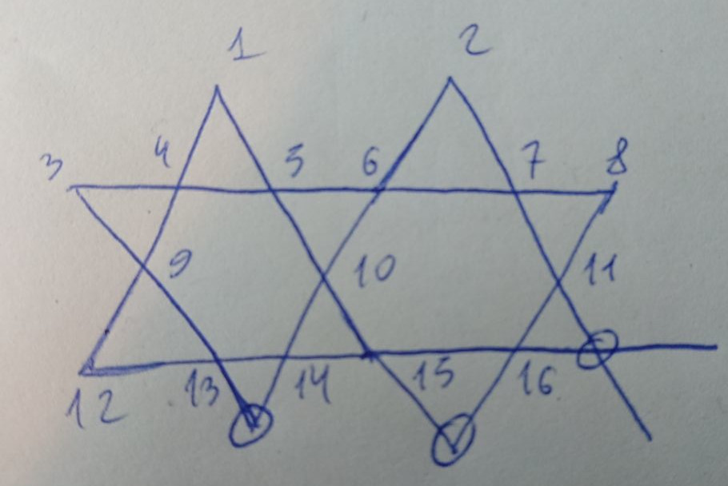
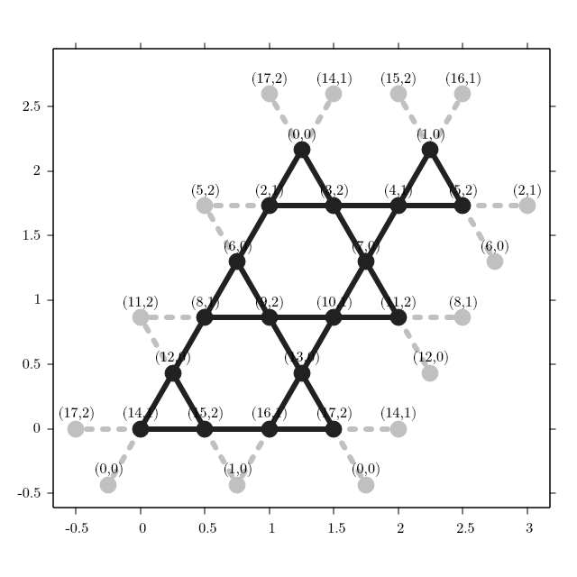
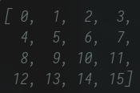

# On the simplicity of sign structure of frustrated quantum systems

## Testing on small systems

* 16-site Heisenberg model on the Kagome lattice (open boundary conditions)

  

  [Hamiltonian](physical_systems/heisenberg_kagome_16.yaml)

* 18-site Heisenberg model on the Kagome lattice (periodic boundary conditions)

  

  [Hamiltonian](physical_systems/heisenberg_kagome_18.yaml)

* 16-site J₁-J₂ model (with J₂/J₁=0.55) on the square lattice

  

  [Hamiltonian](physical_systems/j1j2_square_4x4.yaml)

* 3 instances of 16-site Sherrington-Kirkpatrick model

  [Hamiltonian №1](physical_systems/sk_16_1.yaml), [Hamiltonian №2](physical_systems/sk_16_2.yaml), [Hamiltonian №3](physical_systems/sk_16_3.yaml)

Each of the above yaml files should be diagonalized using [SpinED](https://github.com/twesterhout/spin-ed). For example:

```bash
cd physical_systems
/path/to/SpinED-4c3305 heisenberg_kagome_16.yaml
```
